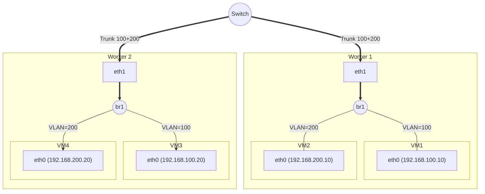

# Cookbook

*Connecting VMs to an underlay VLAN or native network accessible through a secondary (i.e. not the default) host interface.*

Picture.

Identify the NIC you want to use for the network. Remember the name.

Configure NNCP for all workers. Remember the bridge name.

Configure NAD in each namespace, remember the NAD name.

Finally, use it from a VM. Here's an example, find more under ...

